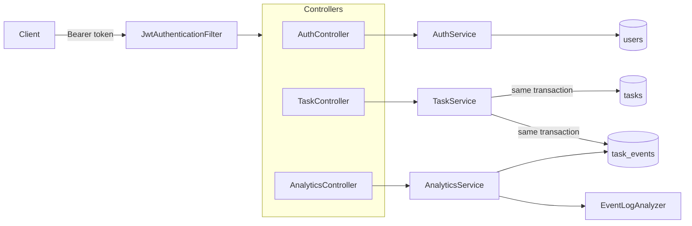

# TaskFlow API

A task management REST API built with Spring Boot 4. Users register, log in with JWT, and manage their own
tasks through a `TODO → IN_PROGRESS → COMPLETED` lifecycle.

Every change to a task is also written to an **event log** in the classic process-mining shape
(*case id, activity, timestamp*). Analytics endpoints mine that log for **cycle times**, **process variants**
and **rework**, and the log can be exported as CSV for a process-mining tool.

## Tech stack

| Area        | Choice                                                            |
|-------------|-------------------------------------------------------------------|
| Language    | Java 17                                                           |
| Framework   | Spring Boot 4.1 (Web MVC, Data JPA, Security, Validation, Actuator) |
| Database    | PostgreSQL, schema managed by Flyway migrations                   |
| Auth        | Stateless JWT (HS256, jjwt) + BCrypt password hashing             |
| API docs    | springdoc-openapi / Swagger UI                                    |
| Tests       | JUnit 5, Mockito, MockMvc, H2 (PostgreSQL mode)                   |

## Architecture



```
src/main/java/com/example/taskflow
├── config/       Security, CORS, OpenAPI and Clock configuration
├── controller/   REST endpoints (thin: validation + HTTP mapping only)
├── dto/          Request/response records; entities are never exposed directly
├── entity/       JPA entities: User, Task, TaskEvent, plus TaskStatus / TaskActivity
├── exception/    Domain exceptions and the global problem+json handler
├── repository/   Spring Data repositories, every task query scoped to its owner
├── security/     JWT service, authentication filter, 401 entry point
└── service/      Business logic and the EventLogAnalyzer (pure Java, unit-tested)

src/main/resources
├── db/migration/ Flyway SQL migrations
└── static/       Web frontend (HTML, CSS, vanilla JS), served by the same app
```

## Running locally

**Prerequisites:** JDK 17+, and PostgreSQL (a local install, or Docker).

1. Start PostgreSQL with a `taskflow` database. With Docker:
   ```bash
   docker compose up -d
   ```
   Or with an existing local PostgreSQL:
   ```bash
   createdb -U postgres taskflow
   ```
2. Configure secrets. Copy `local.properties.example` to `local.properties` (ignored by git) and fill in
   `DB_PASSWORD` and `JWT_SECRET` (at least 32 characters, e.g. `openssl rand -base64 48`).
   Environment variables with the same names work too.
3. Run the app:
   ```bash
   ./mvnw spring-boot:run
   ```
4. Open the web app at <http://localhost:8081/>: register, log in, manage tasks and watch the
   **Process insights** panel update.
5. Or explore the API in Swagger UI at <http://localhost:8081/swagger-ui.html>. Register, log in, click
   **Authorize** and paste the `accessToken`.

Flyway creates the schema on first start. The app refuses to start without a valid `JWT_SECRET`.

## API

All endpoints except authentication, API docs, health and the static frontend pages require
`Authorization: Bearer <accessToken>`.

### Authentication

| Method | Path                    | Description                        |
|--------|-------------------------|------------------------------------|
| POST   | `/api/v1/auth/register` | Create an account (201)            |
| POST   | `/api/v1/auth/login`    | Get a JWT access token             |

### Tasks

| Method | Path                         | Description                                          |
|--------|------------------------------|------------------------------------------------------|
| POST   | `/api/v1/tasks`              | Create a task (201 + `Location` header)              |
| GET    | `/api/v1/tasks`              | List your tasks, newest first. `?status=&page=&size=` |
| GET    | `/api/v1/tasks/{id}`         | Get one task                                         |
| PUT    | `/api/v1/tasks/{id}`         | Replace title, description and status                |
| PATCH  | `/api/v1/tasks/{id}/status`  | Change only the status                               |
| DELETE | `/api/v1/tasks/{id}`         | Delete a task (204)                                  |
| GET    | `/api/v1/tasks/{id}/events`  | The task's event history (also for deleted tasks)    |

### Process analytics

| Method | Path                                | Description                                              |
|--------|-------------------------------------|----------------------------------------------------------|
| GET    | `/api/v1/analytics/event-log`        | Your full event log as JSON                              |
| GET    | `/api/v1/analytics/event-log/export` | The event log as a CSV download                          |
| GET    | `/api/v1/analytics/summary`          | Case counts, tasks per status, rework rate               |
| GET    | `/api/v1/analytics/cycle-time`       | Average / median / min / max time from creation to completion |
| GET    | `/api/v1/analytics/variants`         | Distinct activity sequences, most common first           |

### Errors

Every error is an [RFC 9457](https://www.rfc-editor.org/rfc/rfc9457) `application/problem+json` response.
Validation errors list each invalid field:

```json
{
  "title": "Validation failed",
  "status": 400,
  "detail": "One or more fields are invalid.",
  "errors": { "title": "must not be blank" }
}
```

| Status | When                                                              |
|--------|-------------------------------------------------------------------|
| 400    | Invalid body, unknown status, bad paging parameters               |
| 401    | Missing, expired or tampered token; wrong email or password       |
| 404    | Task does not exist **or belongs to someone else**                |
| 409    | Email already registered; task modified concurrently              |

## The event log

Each task is a **case**. Each change is an **activity** with a timestamp:

| Status change                   | Activity        |
|---------------------------------|-----------------|
| task created                    | `Create Task`   |
| `TODO → IN_PROGRESS`            | `Start Work`    |
| `IN_PROGRESS → TODO`            | `Pause Work`    |
| anything `→ COMPLETED`          | `Complete Task` |
| `COMPLETED →` anything          | `Reopen Task`   |
| title / description changed     | `Update Details`|
| task deleted                    | `Delete Task`   |

Setting a task to the status it already has is not logged. Events are written in the same database
transaction as the change itself, so the log and the task data cannot drift apart. `task_events.task_id` is
deliberately not a foreign key, so the history of deleted tasks is kept.

The CSV export looks like this:

```
case_id,activity,timestamp,from_status,to_status
12,Create Task,2026-01-05T09:00:00Z,,TODO
12,Start Work,2026-01-05T10:00:00Z,TODO,IN_PROGRESS
12,Complete Task,2026-01-05T11:30:00Z,IN_PROGRESS,COMPLETED
```

**Metrics**

- **Cycle time**: first `Create Task` to last `Complete Task` of each case. Cases that were never completed are
  left out.
- **Variants**: cases grouped by their exact activity sequence, with count and share.
- **Rework rate**: cases that were reopened, as a percentage of cases that were completed.

## Example session

```bash
curl -s -X POST localhost:8081/api/v1/auth/register -H 'Content-Type: application/json' \
     -d '{"email":"alex@example.com","password":"correct-horse-battery"}'

TOKEN=$(curl -s -X POST localhost:8081/api/v1/auth/login -H 'Content-Type: application/json' \
     -d '{"email":"alex@example.com","password":"correct-horse-battery"}' | jq -r .accessToken)

curl -s -X POST localhost:8081/api/v1/tasks -H "Authorization: Bearer $TOKEN" \
     -H 'Content-Type: application/json' -d '{"title":"Write README"}'

curl -s -X PATCH localhost:8081/api/v1/tasks/1/status -H "Authorization: Bearer $TOKEN" \
     -H 'Content-Type: application/json' -d '{"status":"COMPLETED"}'

curl -s localhost:8081/api/v1/analytics/cycle-time -H "Authorization: Bearer $TOKEN"
```

## Tests

```bash
./mvnw test
```

The suite needs no setup: it runs against an in-memory H2 database in PostgreSQL mode, with the real Flyway
migrations and the full security chain. To run the same tests against PostgreSQL, set `TEST_DB_URL`,
`TEST_DB_USERNAME` and `TEST_DB_PASSWORD`.

| Test class               | Covers                                                                |
|--------------------------|-----------------------------------------------------------------------|
| `AuthApiTest`            | Registration, validation, duplicate emails, login, no account enumeration |
| `TaskApiTest`            | CRUD, validation, paging, 401 cases (missing / tampered / expired token), ownership isolation |
| `AnalyticsApiTest`       | Event recording, deleted-task history, cycle time, variants, summary, CSV export |
| `TaskServiceTest`        | Service rules with Mockito: which changes produce events               |
| `EventLogAnalyzerTest`   | Cycle-time statistics, median, variant ordering, percentages          |
| `JwtServiceTest`         | Token round trip, expiry, tampering, wrong key, wrong issuer          |
| `JwtPropertiesTest`      | Startup fails with a missing or too-short JWT secret                  |
| `TaskActivityTest`       | Status transition → activity mapping                                  |

Time-dependent tests use a controllable `Clock`, so cycle times and token expiry are tested deterministically.

## Design decisions

- **Ownership in every query.** Repositories look tasks up by `id` *and* `ownerId`. Someone else's task returns
  404 rather than 403, so the API does not reveal which ids exist.
- **Stateless auth.** No server sessions, so CSRF protection is disabled; the JWT filter validates signature,
  issuer and expiry, and checks the account still exists.
- **No account enumeration.** Login returns the same message for an unknown email and a wrong password, and
  runs a BCrypt check in both cases so response times match too.
- **Optimistic locking.** `Task` has a `@Version`, so two concurrent updates cannot silently overwrite each
  other; the loser gets 409.
- **Schema via Flyway, `ddl-auto=validate`.** Hibernate never changes the schema; it only checks the entities
  match the migrations.
- **Secrets outside the code.** Database password and JWT secret come from `local.properties` or environment
  variables; the app fails fast if the JWT secret is missing or too short.
